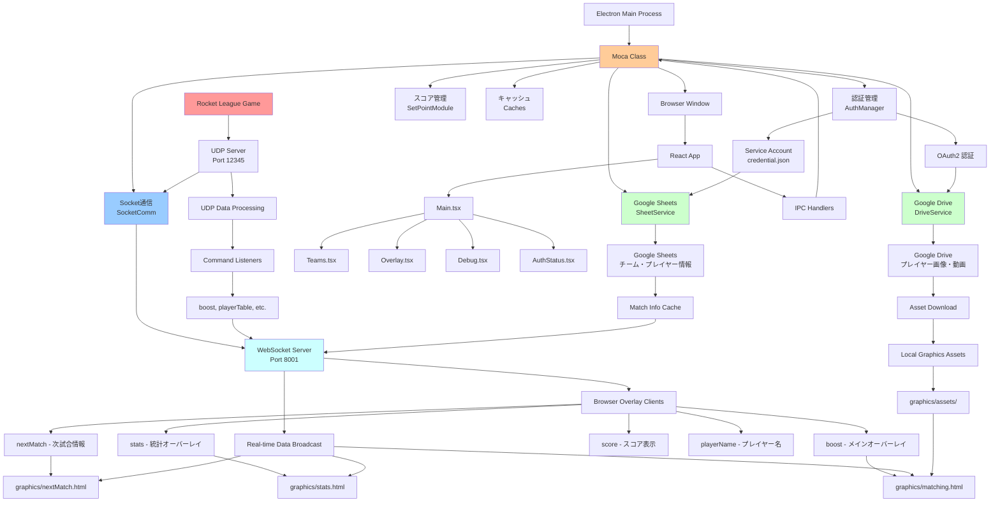

# Moca - Rocket League オーバーレイシステム フロー図



## システム概要

### アーキテクチャ
- **デスクトップアプリ**: Electron + React + TypeScript
- **リアルタイム通信**: WebSocket (port 8001) + UDP (port 12345)
- **外部連携**: Google Sheets API + Google Drive API
- **オーバーレイ**: HTML/CSS/JavaScript ブラウザソース

### コア通信パターン
```
Rocket League → UDP (12345) → WebSocket Server (8001) → Browser Overlays
                     ↓
               Command Processing → Google Services Integration
```

### 主要コンポーネント

#### メインプロセス (src/main.ts)
- **Mocaクラス**: 全システムのオーケストレーター
- **AuthManager**: Google認証の管理
- **SocketComm**: UDP/WebSocket通信ハンドリング
- **SetPointModule**: スコア・ポイント管理ロジック

#### 通信システム (src/api/socket_communication.ts)
- **UDPサーバー**: Rocket Leagueからデータ受信 (127.0.0.1:12345)
- **WebSocketサーバー**: ブラウザオーバーレイにリアルタイム配信 (port 8001)
- **コマンドリスナー**: データ処理とルーティング

#### Google統合
- **SheetService**: チーム・プレイヤー情報の管理
- **DriveService**: プレイヤー画像・動画アセットの同期

#### オーバーレイシステム
- **matching.html**: メイン試合オーバーレイ (ブースト、スコア、プレイヤー)
- **stats.html**: 試合後統計表示
- **nextMatch.html**: 次の試合情報表示

### データフロー
1. **ゲームデータ**: Rocket League → UDP → コマンド処理
2. **WebSocket配信**: 処理済みデータ → 全ブラウザクライアント
3. **Google同期**: Sheets/Drive → ローカルキャッシュ → オーバーレイ
4. **UI制御**: React制御パネル → IPC → メインプロセス

### ブラウザソースエンドポイント
- `ws://localhost:8001/boost` - メイン試合オーバーレイ
- `ws://localhost:8001/stats` - 統計オーバーレイ  
- `ws://localhost:8001/nextMatch` - 次試合情報
- `ws://localhost:8001/score` - スコア表示のみ
- `ws://localhost:8001/playerName` - プレイヤー名表示
